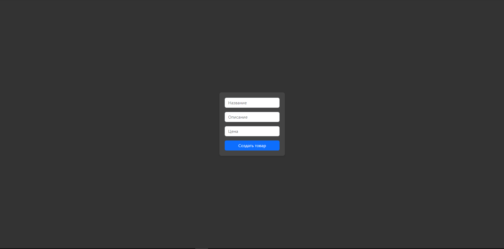

# Тестовое задание для собеседования в компанию "Brendwall"
### Тестовое задание: API для продуктов и работа с фронтендом



### Установка
Клонирование проекта и переход в папку проекта:
```shell
git clone https://github.com/KlimentFis/Product.git && cd Product
```

Установка и активация виртуального окружения ( Не обязательно ):
```shell
python -m venv venv && venv\Scripts\activate.bat
```

Установка зависимостей:
```shell
pip install -r req.txt
```

Создание миграций:
```shell
python manage.py makemigrations
```

Проведение миграций:
```shell
python manage.py migrate
```

### Запуск проекта
Для локальной разработки:
```shell
python manage.py runserver
```
Для продакшена:
```shell
python manage.py runserver 0.0.0.0:8888
```

### Руководство по REST API
- Swagger: http://127.0.0.1:8000/swagger-docs/
- ReDoc: http://127.0.0.1:8000/redoc/